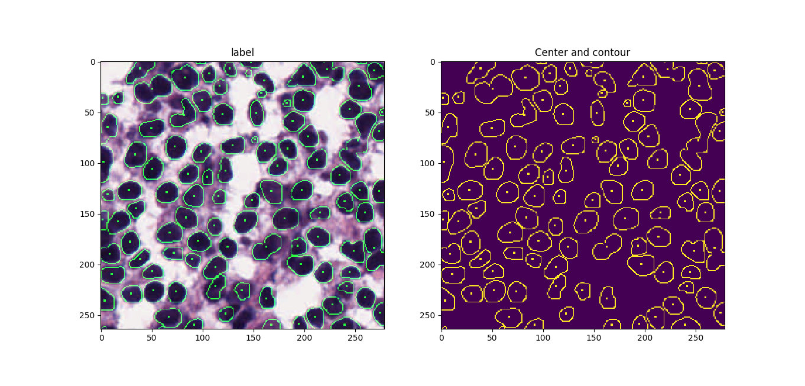

# Cell-Nuclei-Detection-and-Segmentation
This is a general prototype to detect location and draw boundary of nuclei from tissue miscropic images (H&E stained).
The model is based on U-net [1] with edge enhancement in loss function. 

 
### Dependencies
- Tensorflow
- OpenCV
- Scikit-image
- Numpy
- Matplotlib

#### More
- [x] detection and segmentation model
- [x] consider edge into loss function during training
- [x] morphology operation to calculate center and boundary
- [ ] identify overlapping samples with individual segmentation model
- [ ] identify tissue types 

#### Reference
[1] Olaf Ronneberger, Philipp Fischer, Thomas Brox, U-Net: Convolutional Networks for Biomedical Image Segmentation,  	arXiv:1505.04597.
